# 机票预定系统

### 正则表达式验证身份证

^[1-9]\d{5}(19|20)\d{2}(0[1-9]|1[0-2])(0[1-9]|[12][0-9]|3[01])\d{3}([0-9]|X)$

该正则表达式的含义为：

- `^` 表示字符串的开头。
- `[1-9]` 表示第一位必须是非零数字。
- `\d{5}` 表示接着后面的5位数字可以是0-9之间的任意数字。
- `(19|20)` 表示年份的前两位只能是19或20。
- `\d{2}` 表示年份的后两位可以是0-9之间的任意数字。
- `(0[1-9]|1[0-2])` 表示月份可以是01-12之间的数字，其中0可以省略。
- `(0[1-9]|[12][0-9]|3[01])` 表示日期可以是01-31之间的数字，其中0可以省略。
- `\d{3}` 表示出生年月日后面的3位数字可以是0-9之间的任意数字。
- `([0-9]|X)` 表示身份证的最后一位可以是0-9之间的任意数字或X。
- `$` 表示字符串的结尾。

## 演示：

### 1.登录注册

当启动服务器时，来到机票预定系统登录页面。

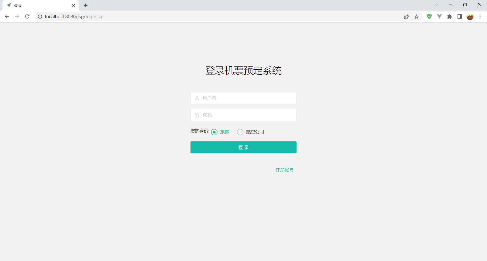

首次来到此系统，可以点击“注册账号”进行系统账号的注册。

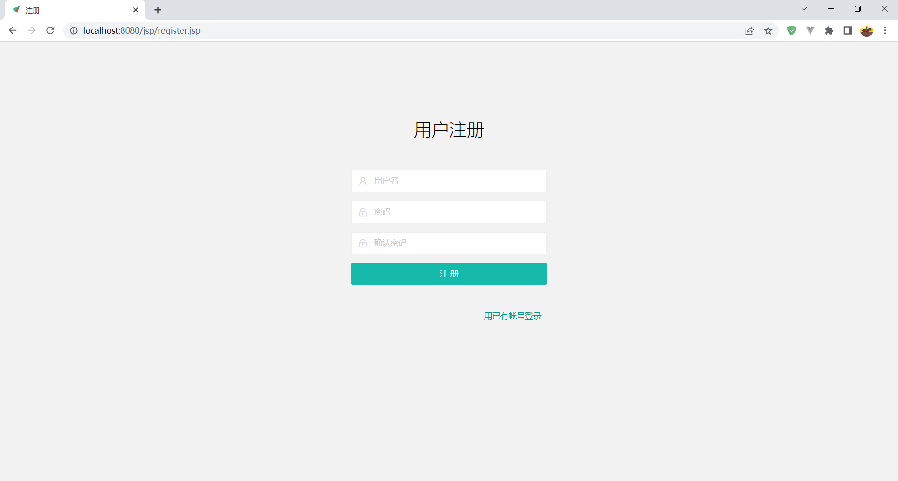

在这个页面，你可以通过输入用户名，密码，确认密码完成账号的注册，前端会判断两次输入的密码是否相同，同时系统为了保证用户名的唯一性，会在注册时查询数据库中是否含有此用户名，如果已存在此用户名会注册失败，并提示重新注册。注册成功后会提示注册成功并跳转到登录界面。当然，如果你存在账户，也可以点击“用已有账号登录”回到登录界面。

在登录界面输入用户名、密码并选择身份进行登录。我们先以用户的身份登录。

### 2.用户页面：

登录成功来到welcome.jsp页面，会以轮播图的形式展现几张系统图片。

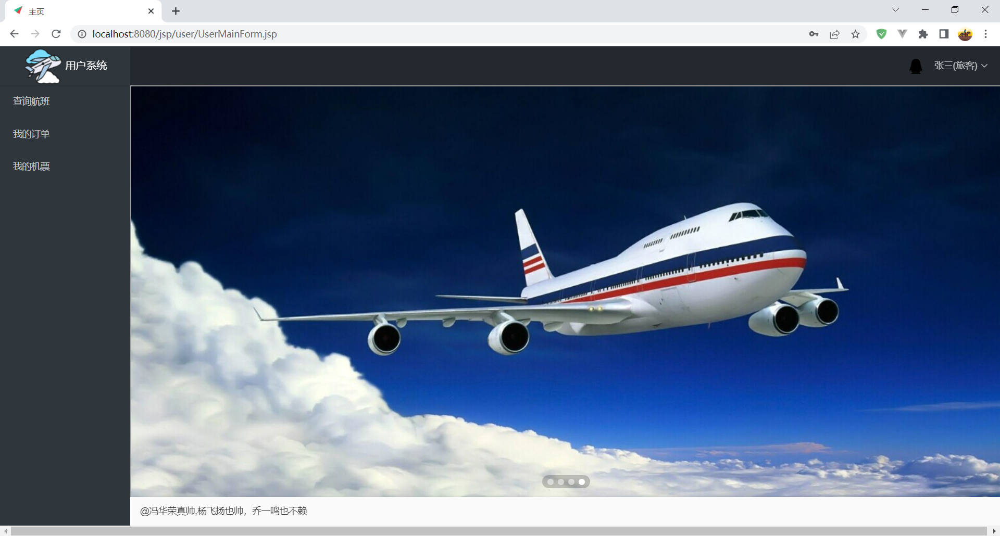

在用户订票系统里，用户可以查询航班，查看订单和查看机票

#### 1.查询航班

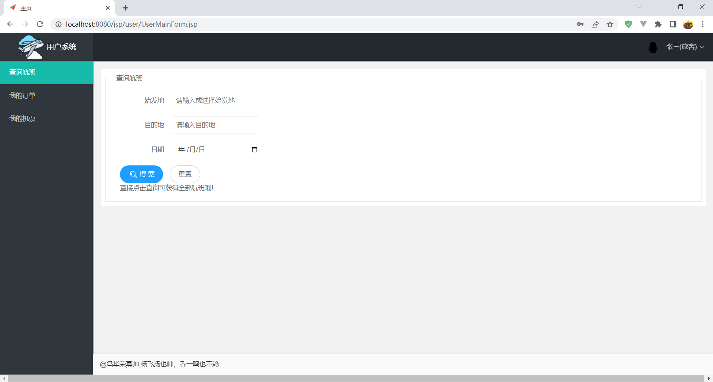

用户可以根据始发地、目的地、日期来查询航班，并且系统会查询数据库所有的始发地，用户可以手动输入，也可以点击输入框右边箭头选择始发地。查询不要求输入所有内容，用户可根据需要输入。当什么都不输入时，即查询所有的航班。

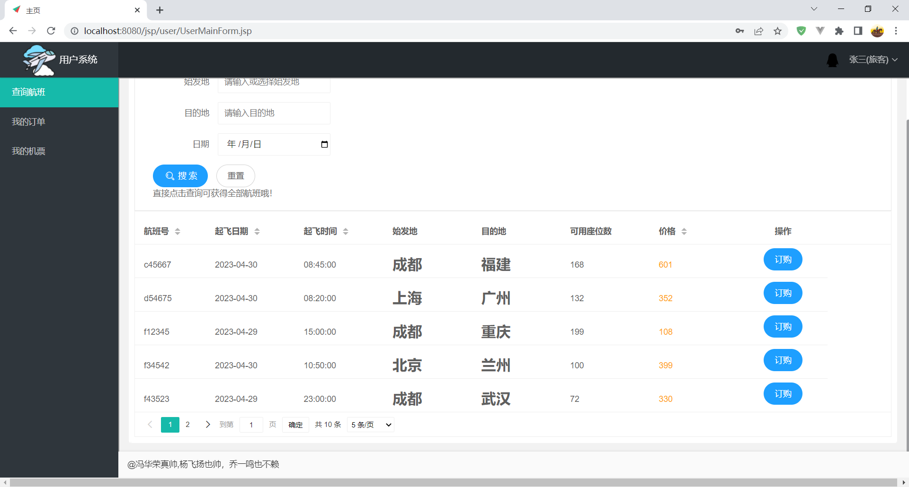

查询采用分页显示，这里默认每页显示5条数据，你也可以点击下方选择框选择其它显示的页数。

当你查询到你所需要的航班时，点击右侧订购按钮即可订票，如果你第一次注册或没有完成身份证和性别的录入，会提示请先填写身份信息，并且2.5秒后自动打开修改资料页面，你也可以手动点击右上角头像选择“修改资料”进行填写。当然，当航班的可用座位数为0时，也会提示该航班不可订票。

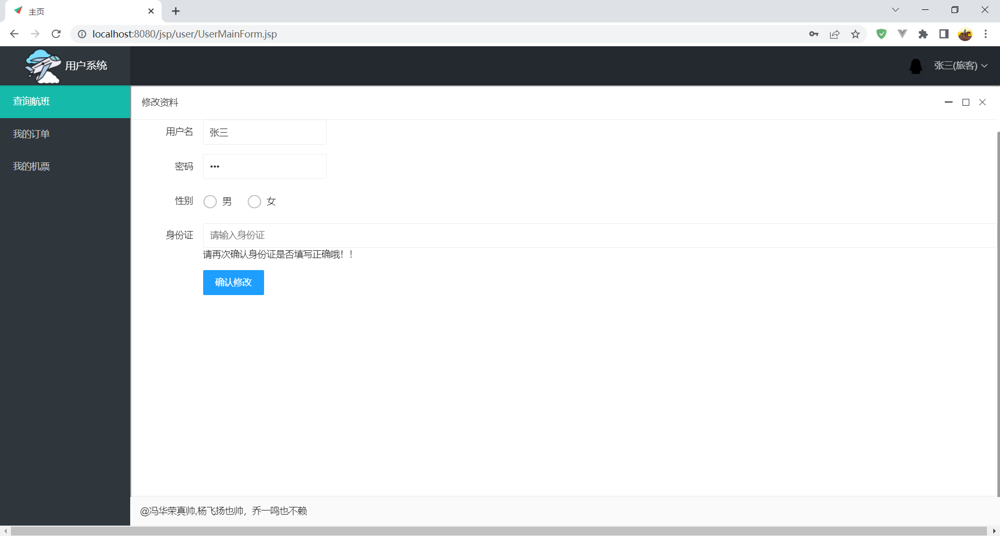

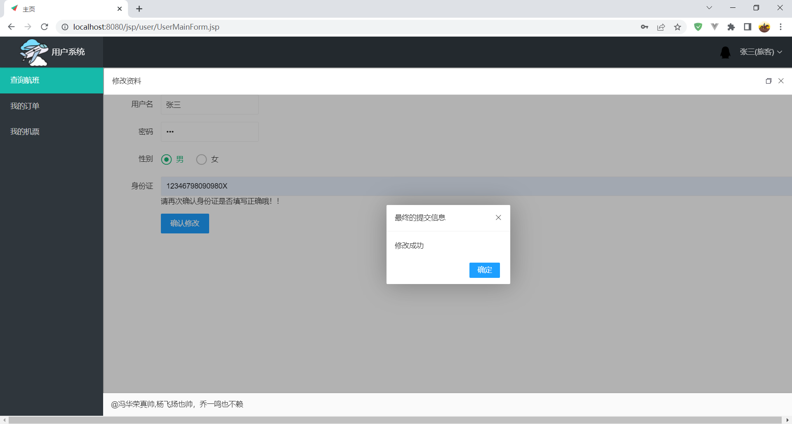

当修改成功后即可正常完成订票。订票分为三步，第一步确定旅客的信息，并且可以选择航班席位，填写订单备注。

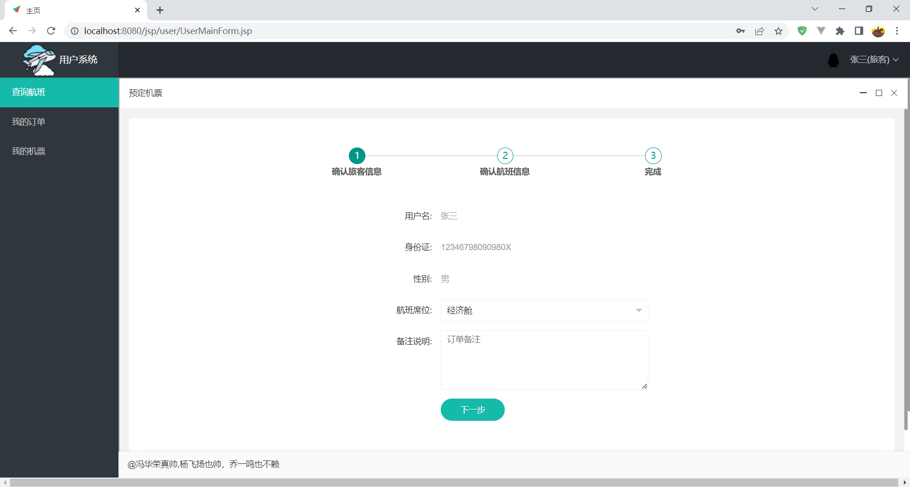

第二步确定航班信息，确认后可以选择暂时预定，也可以直接选择支付航班的费用。

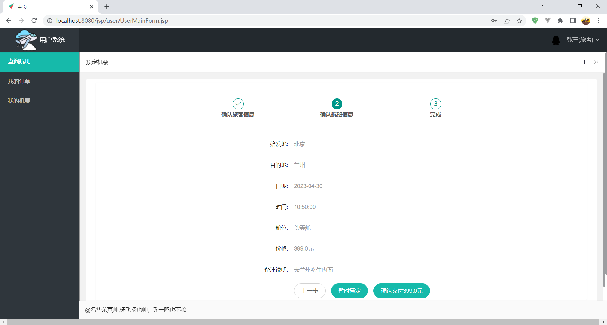

第三步即完成订单的创建。并且航班的可用座位数相对应减掉1。

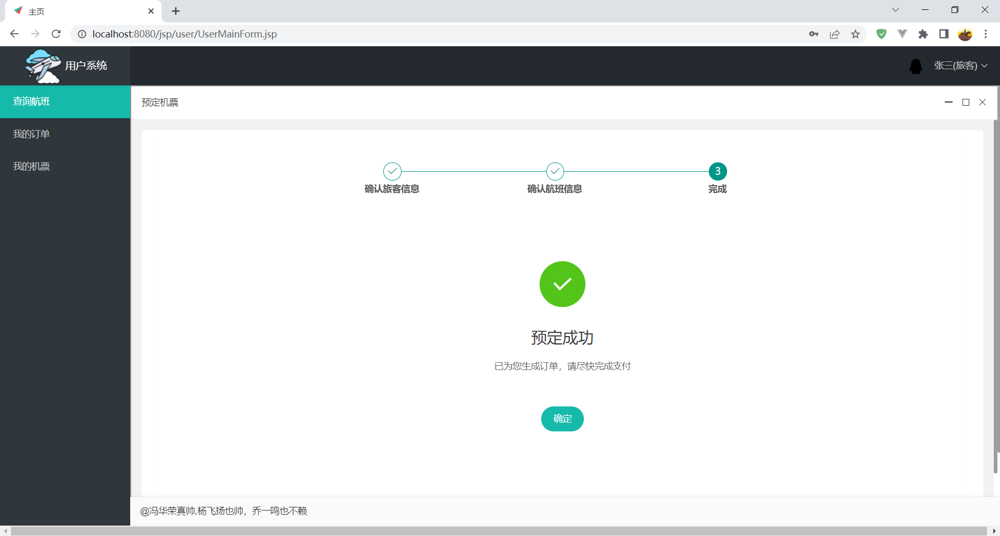

#### 2.我的订单

在“我的订单”里即可查看到当前用户的所有订单，同样采用分页显示。可以看到订单的信息，创建和修改的时间和订单的状态以及一些对订单的操作。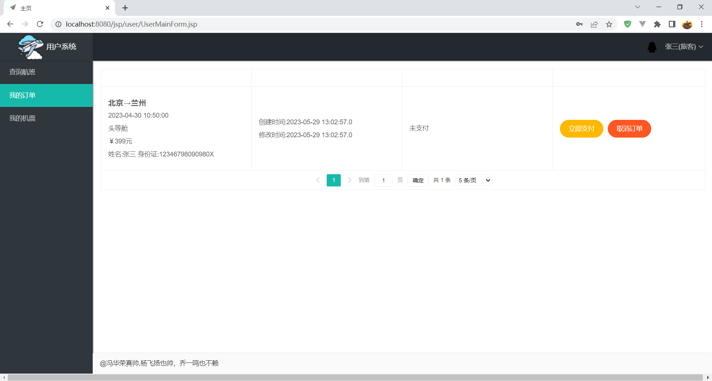

#### 3.我的机票

当完成支付、打印出票后，即可在“我的机票”里查看到机票。

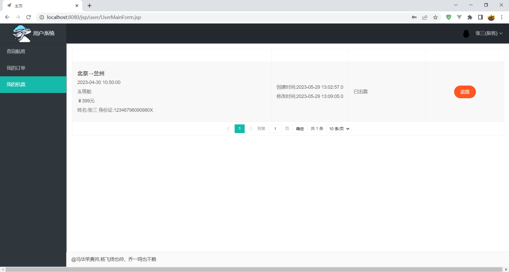

当然，出于紧急情况考虑，打印出票后依然可以选择退票，当退票和取消订单后，航班的可用座位数又将加上1。

至此，用户界面所有操作演示完毕。

### 2.公司页面

以公司账号登录，即可来到公司页面，公司主要负责旅客管理，航班管理和订单管理

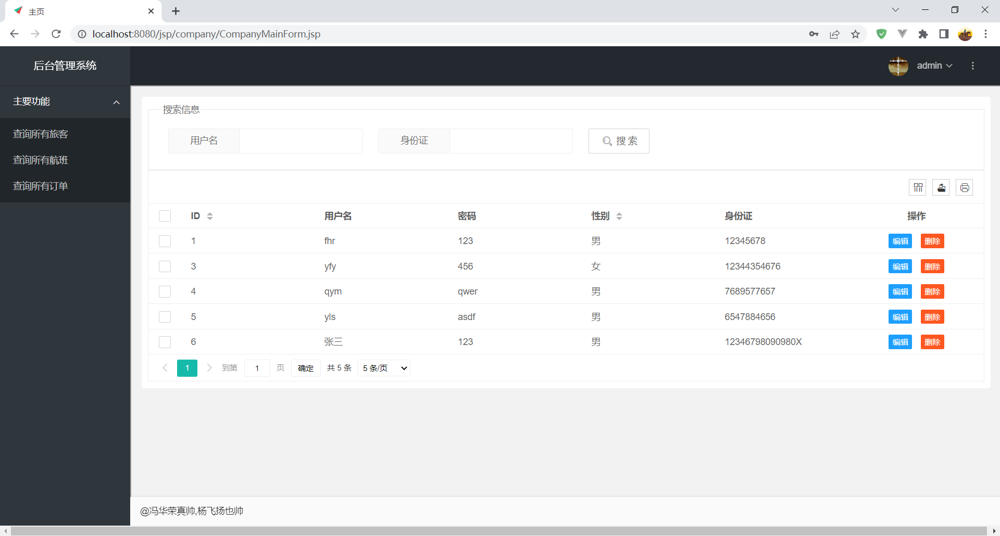

#### 1.旅客管理

页面展示当前系统所有用户信息，可以通过用户名和身份证查询用户。公司可以编辑用户信息，删除用户

#### 2.航班管理

页面展示当前系统所有航班信息，可以通过始发地，目的地，日期查询航班，可以对航班进行添加，修改和删除。

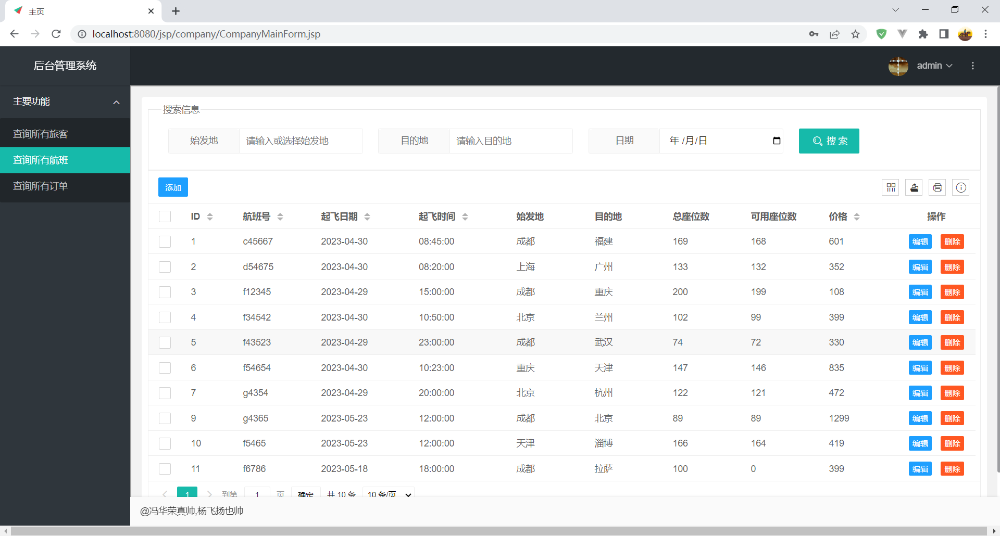

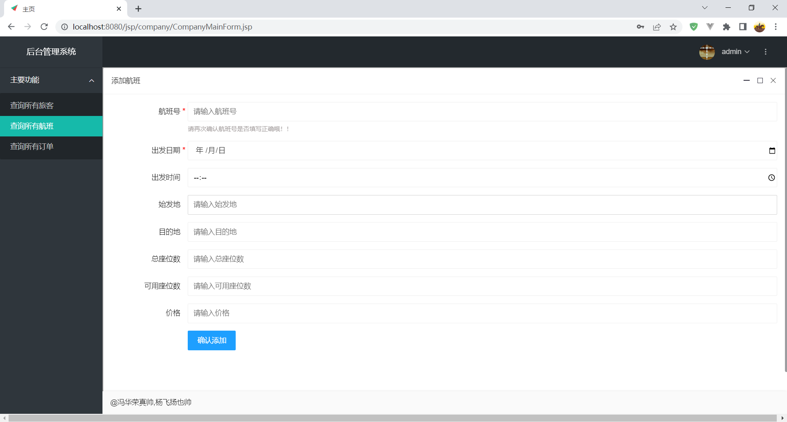

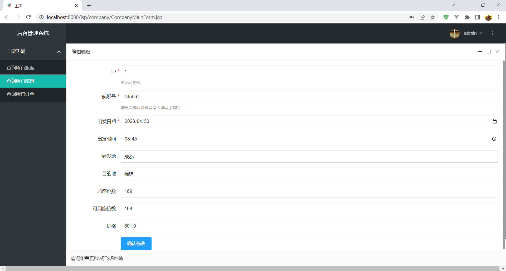